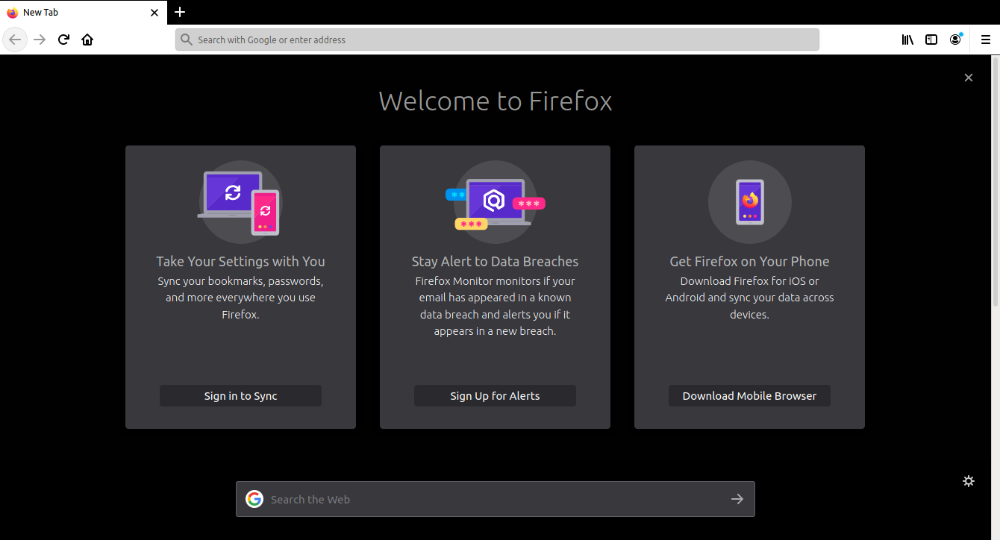

# Contrasty
## Minimal Black and White theme for Firefox

You can install the theme from [here](https://addons.mozilla.org/en-US/firefox/addon/contrasty/) or package it yourself (steps below)

## Preview

## Screenshot

## How to package this theme and sign it?
1. Only the manifest.json file needs to be zipped. You can do so by following the instructions from [here](https://extensionworkshop.com/documentation/publish/package-your-extension/)
2. Make a firefox account (if you don't have one) and submit a new theme on [https://addons.mozilla.org/en-US/developers/addons](https://addons.mozilla.org/en-US/developers/addons)
